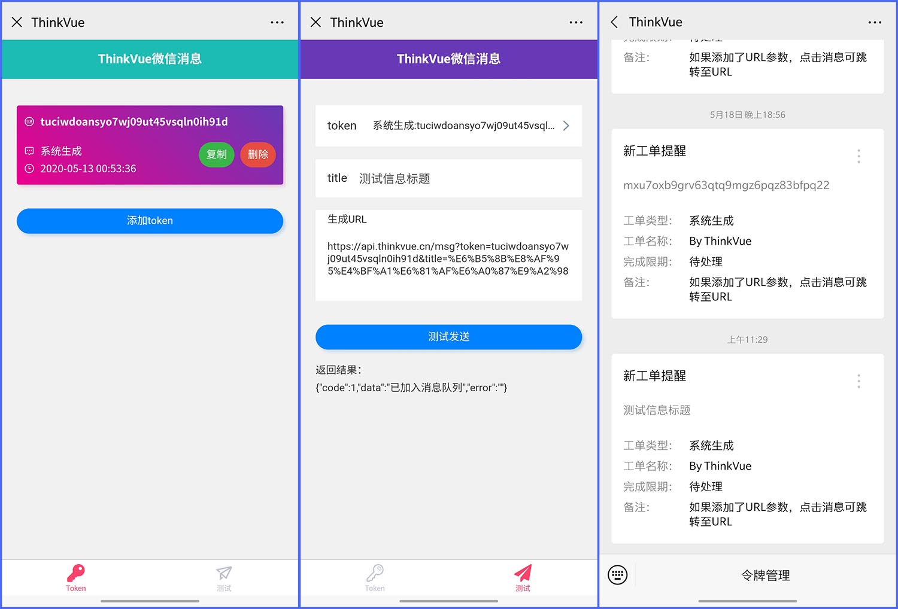

# WxMsg微信消息推送

## 用途及原理

通过Web接口向微信发送消息，可用于工单、服务器报警、抢票等消息服务。  
前后端分离，前端负责提供用户接口，让用户在微信公众号中管理应用Token；后端API处理数据提交到数据库；Python服务程序负责与腾讯微信服务器通讯，发送消息。
后端 Thinkphp 5.1.1+MySQL 5.6 ， 前端Uni-APP , 腾讯微信服务器通讯服务：Python 。

## 涉及的技术栈

- Python 3
- Thinkphp 5.1
- Vue 2
- Uni-App
- MySQL
- Bash
- PyPI

## 安装前准备：

- 安装了PHP 7和MySQL 5.5以上版本的服务器；
- 已经备案的域名分配两个子域名，指向服务器，一个用于后台API，另一个用于前台用户接口；
- 微信公众号（AppID和AppSecret），开通了模版消息[[如何开通模版消息](./md/template_id.md)]；
- 用于发送故障邮件的邮箱，需要开通安全SMTP；
- 短信接口，【[阿里云短信](https://www.aliyun.com/acts/alicomcloud/new-discount?spm=5176.11533457.1089570.34.48e877e3FKTGdQ&userCode=9fbzncbl)】或者【[短信宝](https://www.smsbao.com/)】

## 一键安装命令

> 无需手动下载任何文件，一个命令完成安装、配置，向导式安装。
> 手动安装会非常麻烦，不建议手动安装。在官网提供了具体教程。

### Centos安装命令

`yum install -y wget && wget -O install_1.0.4.sh http://api.thinkvue.cn/install_1.0.4.sh && sudo sh install_1.0.4.sh`

### Ubuntu/Deepin安装命令

`wget -O install_1.0.4.sh http://api.thinkvue.cn/install_1.0.4.sh && sudo bash install_1.0.4.sh`

### Debian安装命令

`wget -O install_1.0.4.sh http://api.thinkvue.cn/install_1.0.4.sh && bash install_1.0.4.sh`

## 安装后配置

- [如何设置网站](./md/img/website.md)
- [如何设置微信公众号](./md/img/wechat_auth.md)
- [如何设置微信公众号模版消息](./md/img/template_id.md)

## 效果图

## 开源许可
[MIT](./LICENSE.txt)