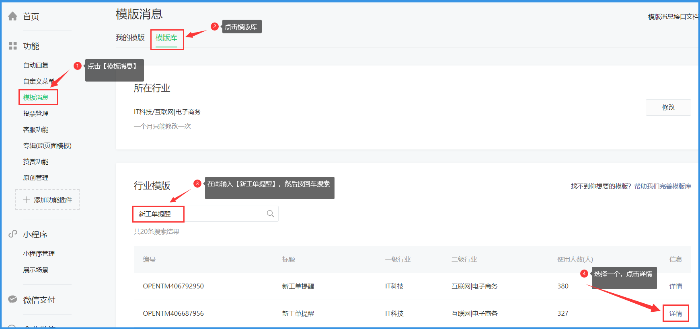

# 微信公众号添加模版消息

**1. 首先登录微信公众号，确认公众号有没有模版消息权限（点击左侧菜单最后一个【开发】→【接口权限】）**

**2. 把模版消息添加至主界面，点击左侧菜单【功能】→【添加功能插件】**

**3. 添加新的模版，点击【模版库】→在搜索框输入【新工单提醒】按回车，选择一个有3个keyword的模版即可**

**4. 内容随意，只要是包含且仅包含`first`,`keyword1`,`keyword2`,`keyword3`,`remark`等5项内容的模版都可以**

**5. 添加成功后，回到主界面，复制模版消息ID待用**

# 其他帮助链接

- [如何设置网站](./website.md)
- [如何设置微信公众号](./wechat_auth.md)
- [如何设置微信公众号模版消息](./template_id.md)

