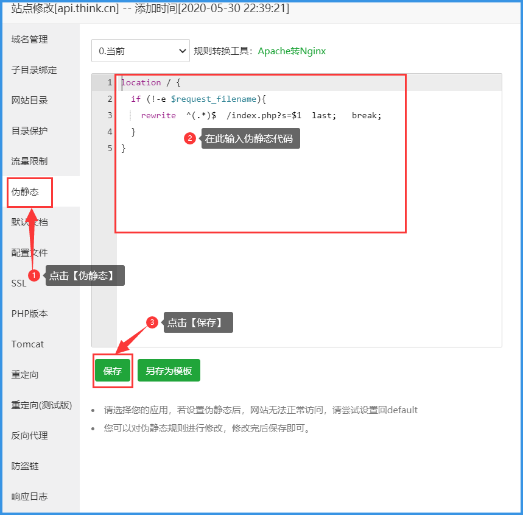
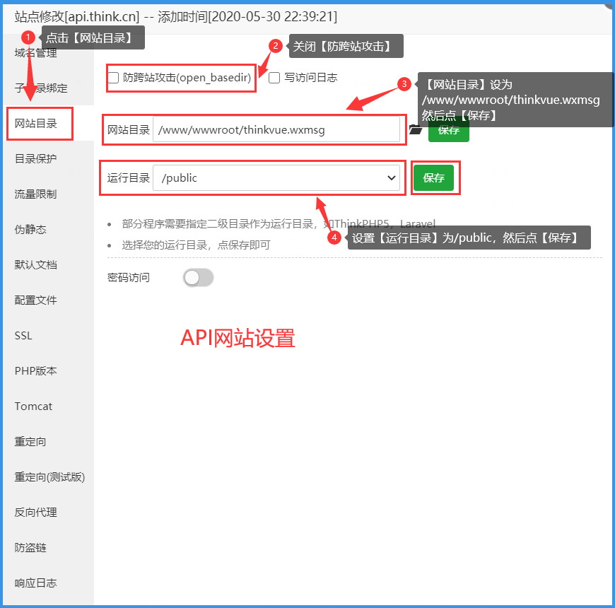
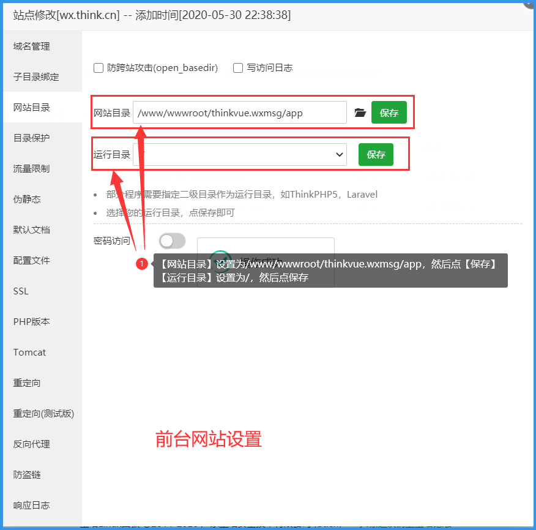
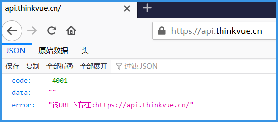
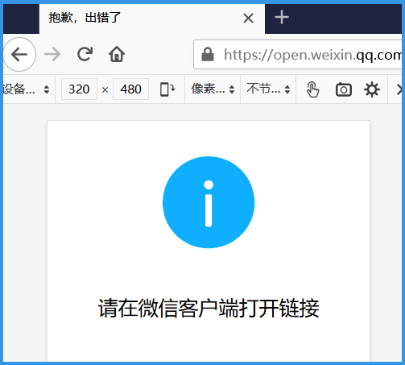
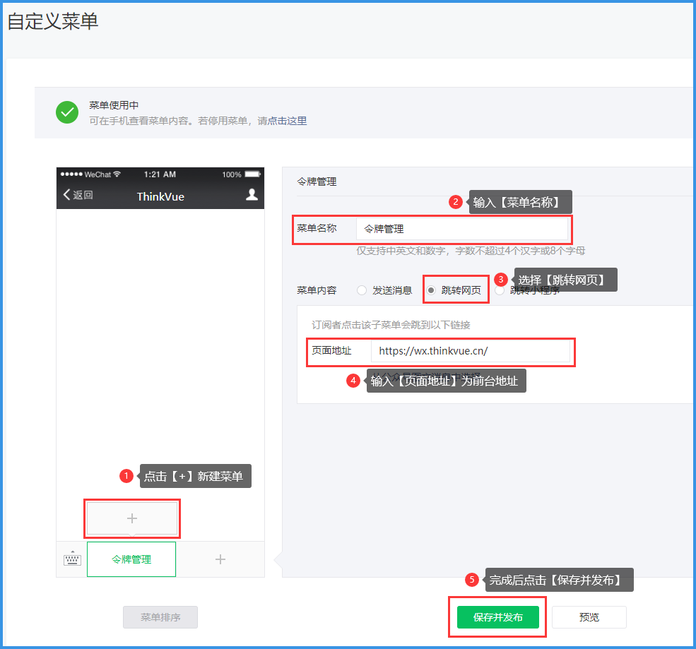

# 设置API和前台网站

> 本文一步一步教你如何设置后台API网站和前台用户接口网站，包含设置伪静态、运行目录、开通SSL等。下面以宝塔面板设置为例。

>> PS: 宝塔面板是提升运维效率的服务器管理软件，支持一键LAMP/LNMP/集群/监控/网站/FTP/数据库/JAVA等100多项服务器管理功能。[[如何安装宝塔面板](https://www.bt.cn/bbs/thread-19376-1-1.html)]

## 1. 登录宝塔面板，新建两个网站，一个用于后台API，另一个用于前台用户接口，假设两个子域名分别为【api.thinkvue.cn】和【wx.thinkvue.cn】，且都已正确解析为服务器IP地址。然后点击网站的【设置】→【伪静态】，输入伪静态代码，然后点击【保存】。如果是Apche则跳过这一步，网站代码已经包含Apche伪静态文件【.htaccess】，不需要额外设置。

**后台API网站伪静态代码：**
```javascript
location / {
	if (!-e $request_filename){
		rewrite  ^(.*)$  /index.php?s=$1  last;   break;
	}
}
```
**前台网站伪静态代码：**
```javascript
location / {
  try_files $uri $uri/ /index.html;
}
```




## 2. 这一步设置的是后台API网站：点击后台API网站【设置】→【网站目录】，去掉勾选【防跨站攻击】，输入【网站目录】为`/www/wwwroot/thinkvue.wxmsg`，选择【运行目录】为`/public`，点击【保存】。如果是其他面板或者命令，无法分别设置根目录和运行目录的，把根目录设置为`/www/wwwroot/thinkvue.wxmsg/public/`即可。




## 3. 这一步设置的是后台API网站：点击后台API网站【设置】→【网站目录】，去掉勾选【防跨站攻击】，输入【网站目录】为`/www/wwwroot/thinkvue.wxmsg`，选择【运行目录】为`/public`，点击【保存】




## 4. 打开浏览器，输入后台API网址【https://api.thinkvue.cn】，如果显示以下内容即安装成功。




## 5. 打开浏览器，输入前台网址【http://wx.thinkvue.cn】，如果跳转至微信服务器地址即安装成功。




## 6. 登录微信公众号，点击左侧菜单【功能】→【自定义菜单】→点击【+】新建菜单，输入【菜单名称】，选择【跳转网页】，输入【页面地址】，如果开启了SSL则为【https://wx.thinkvue.cn/】，如果未开启SSL则为【http://wx.thinkvue.cn/】，点击【保存并发布】，菜单就生效了。




# 其他帮助链接

- [如何设置网站](./website.md)
- [如何设置微信公众号](./wechat_auth.md)
- [如何设置微信公众号模版消息](./template_id.md)
