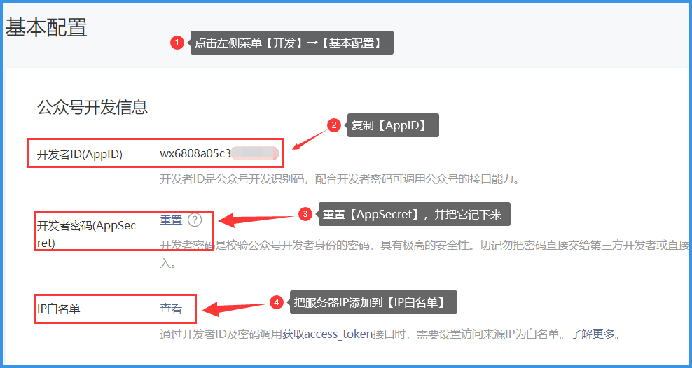
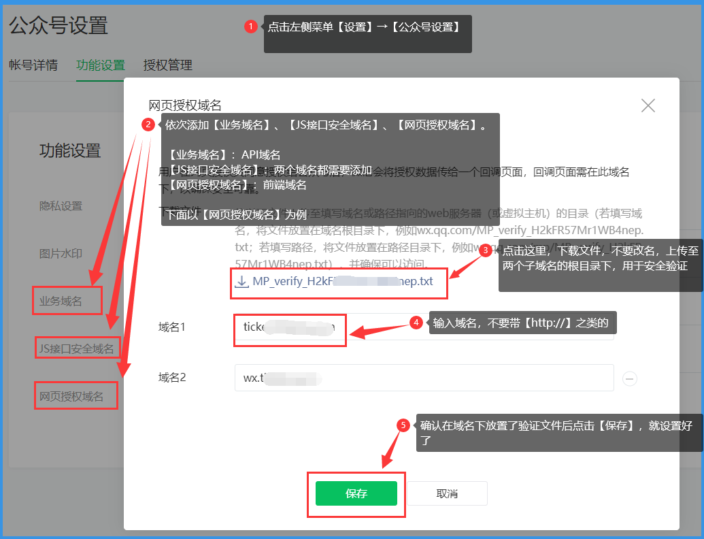

# 微信公众号设置

## 1. 首先登录微信公众号，点击左侧菜单【开发】→【基本配置】，复制【AppID】和【AppSecret】待用，设置服务器的IP进白名单

## 2. 回到主界面，点击左侧菜单【设置】→【公众号设置】→【功能设置】，把相应域名添加到相应设置项里

# 其他帮助链接

- [如何设置网站](./website.md)
- [如何设置微信公众号](./wechat_auth.md)
- [如何设置微信公众号模版消息](./template_id.md)
